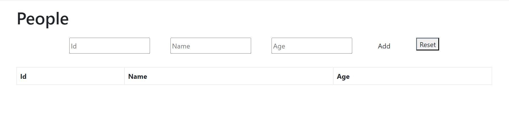
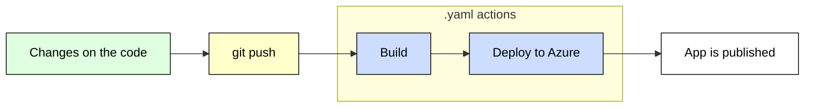

# Azure Web App
A simple application used for learning the fundamentals of CI/CD.
Check it out [here](https://azure-web-app-demo.azurewebsites.net/).

## Summary
This application serves the purpose of practicing the Continuous Integration and Continuous Deployment through it's implementation in an [Microsoft Azure](https://azure.microsoft.com/en-us/free/search/?ef_id=_k_CjwKCAjwvJyjBhApEiwAWz2nLdW-I6p2M4TEgHFVfpfzWmdw_n_VWPFPeT5asHpjx-teijvkR9FwxBoCE60QAvD_BwE_k_&OCID=AIDcmmzmnb0182_SEM__k_CjwKCAjwvJyjBhApEiwAWz2nLdW-I6p2M4TEgHFVfpfzWmdw_n_VWPFPeT5asHpjx-teijvkR9FwxBoCE60QAvD_BwE_k_&gclid=CjwKCAjwvJyjBhApEiwAWz2nLdW-I6p2M4TEgHFVfpfzWmdw_n_VWPFPeT5asHpjx-teijvkR9FwxBoCE60QAvD_BwE) hosted web page.

## Introduction
This is a simple web application developed using [ASP.NET Core Razor Pages](https://learn.microsoft.com/en-us/aspnet/core/razor-pages/?view=aspnetcore-7.0&tabs=visual-studio). The primary goal of the application is to provide a hands-on experience with the implementation of Continuous Integration/Continuous Deployment (CI/CD) using GitHub Actions and Microsoft Azure.

The application features a simple interface that allows users to add a Person to a list, with the details displayed on-screen as a table. Each Person object contains the following properties:

-   Id
-   Name
-   Age

The interface also includes a "Reset" button for clearing the list.

## Structure and Tools
The application is composed of the following components:
1. **Directories**: The application is distributed in two main folders: **./Models** and **./Pages**. The Models folder contains the model classes for **Person** and the **data base context**, while the pages folder contains the **Error.cshtml**, **Index.cshtml** and **People.cshtml** files.
2. **Person Model**: A basic class located in the Models directory, representing the Person object, which has the properties - Id, Name and Age.
3. **In-Memory Data Storage**:  The application uses a simple In-Memory storage to temporarily hold and manipulate the instances of the Person object.
4. **This Github Repository**: Used to store the codebase and configuration files for **GitHub Actions**.
5. **Microsoft Azure**: This application is deployed with the help of Azure to create the CI/CD Pipeline.

## Usage
When running the application, you will see a simple interface. Here you can:
- **Navigate the Pages**: Use the navigation bar in the top of the home page in order to navigate between the Home and People pages.

### People Page
In the People page, you can:
-   **Add a Person**: Input the ID, Name, and Age in the corresponding fields and press the "Add" button. The added person will appear in the list below.
-   **Reset the List**: To clear the list, simply press the "Reset" button.

## CI/CD Pipeline with GitHub Actions
The application includes a `.github/workflows/main.yml` file, which contains the configuration for the CI/CD pipeline. Upon every push to the [GitHub repository](https://github.com/MartinbianchoEduardo/azure-web-app), the following steps will be executed automatically:
1. **Build**: An artifact of the application is built.
2. **Deploy**: The built application is deployed to Azure.

### Setting up the Deploy
In order to set up the Deploy and Publish to Azure process in the `.yml` file, an artifact must be generated. This can be done by using the actions:
1. **Upload artifact for deployment job**: After the build is done, the `actions/upload-artifact@v2` action is executed.
2. **Download artifact from build job**: In the Deploy process, the `actions/download-artifact@v2` action is executed to download the previously uploaded artifact. 

We'll use this actions to properly store the artifact created in the build process. 

### Build and Deploy jobs
The `.yml` file contains two defined jobs: **build** and **deploy**. Each job has their own responsabilities and executes a pre-determined set of actions in order to build and deploy the application to Azure.
### 1. Build
The first action taken in the build job is to checkout from our repository so the workflow can access it, using `actions/checkout@v3`. Learn more about the `checkout@v3` action [here](https://github.com/actions/checkout). After the checkout is done, .NET Core is set by using the [`actions/setup-dotnet@v1`](https://github.com/actions/setup-dotnet) action. 
>**Note**: An [ASP.NET](https://learn.microsoft.com/en-us/aspnet/core/?view=aspnetcore-7.0) Core project usually includes a set up for the NuGet package manager in the `.yml` file. However, since this application does not contain any packages or external dependencies, this is not needed. If you want to build an [ASP.NET Core](https://learn.microsoft.com/en-us/aspnet/core/?view=aspnetcore-7.0) application that needs NuGet, check out its [documentation](https://learn.microsoft.com/en-us/azure/app-service/deploy-github-actions?tabs=applevel). 

Next, the `dotnet build` and `dotnet publish` actions are executed. Here we build the application and publish it the resulting set of files to a directory. These files are now ready for deployment to a hosting system for execution.

Lastly, the artifact is uploaded for the deployment job, using the `actions/upload-artifact@v3` action. This uploads the artifacts from the workflow allowing data to be shared with other jobs (we'll use this artifact in the deploy job).

### 2. Deploy
In the Deploy job, we first need to download the artifact from build job. This is done using the `actions/download-artifact@v2` and gives us access to manage the build artifact created in the previous job. 

Finally, we can deploy the application using the `azure/webapps-deploy@v2` action. This will deploy the downloaded artifact to the Azure Web App. Here the web app name must be defined as well as the path to the GitHub publish profile.

### Pipeline Flowchart
Check out the pipeline flowchart to get a better grasp of the pipeline above:

## Conclusion

Altough this is a very basic website, the experience of developing provided a great, clear and straightforward example of the Continuous Integration/Continuous deployment principles in action. While developing this application, it becomes as clear as day why CI/CD is broadly used in software development, since its capabilities of enabling rapid, reliable and repeatable processes for merging code changes, testing and deploying applications are unmatched.

